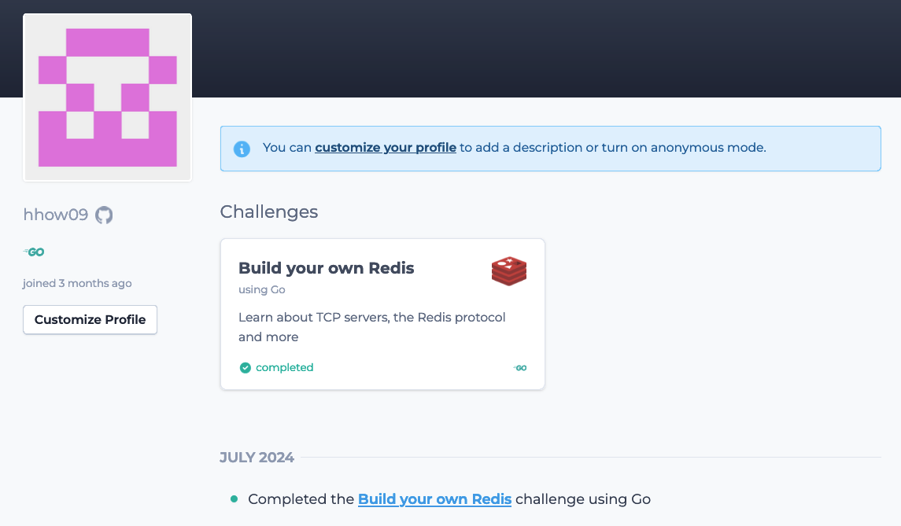

# Build your own Redis
[](https://app.codecrafters.io/users/codecrafters-bot?r=2qF)

## [Overview](https://app.codecrafters.io/courses/redis/overview)
Redis is an in-memory data structure store often used as a database, cache, message broker and streaming engine. In this challenge you'll build your own Redis server that is capable of serving basic commands, reading RDB files and more.

Along the way, you'll learn about TCP servers, the Redis Protocol and more.

## Key Features
- [x] implement [RESP](https://redis.io/docs/latest/develop/reference/protocol-spec/) Protocol (in [resp](./app/resp/resp.go))
- [x] [PING](https://redis.io/docs/latest/commands/ping/), [ECHO](https://redis.io/docs/latest/commands/echo/) Command
- [x] [SET](https://redis.io/docs/latest/commands/set/), [GET](https://redis.io/docs/latest/commands/get/) Command
- [x] Persistence: Load and Save [RDB File](https://rdb.fnordig.de/file_format.html) (in [Persistence](./app/persistence))

### [Replication](https://redis.io/docs/latest/operate/oss_and_stack/management/replication/)
- [x] Replica handshake with master
- [x] Replica Sync RDB from master
- [x] Command propagation to replicas
- [x] [WAIT](https://redis.io/docs/latest/commands/wait/) Command

### Streams 
- [x] [XADD](https://redis.io/docs/latest/commands/xadd/) Command
- [x] [XREAD](https://redis.io/docs/latest/commands/xread/) Command
- [x] blocking [XREAD](https://redis.io/docs/latest/commands/xread/) Command
- [x] [XRANGE](https://redis.io/docs/latest/commands/xrange/) Command

### Transactions
- [x] [MULTI](https://redis.io/docs/latest/commands/multi/) Command
- [x] [EXEC](https://redis.io/docs/latest/commands/exec/) Command
- [x] [DISCARD](https://redis.io/docs/latest/commands/discard/) Command

## [Progress: Completed](https://app.codecrafters.io/users/hhow09)
passed tests from every stage from codecrafters.io




---
## Development Notes
This is a starting point for Go solutions to the
["Build Your Own Redis" Challenge](https://codecrafters.io/challenges/redis).

In this challenge, you'll build a toy Redis clone that's capable of handling
basic commands like `PING`, `SET` and `GET`. Along the way we'll learn about
event loops, the Redis protocol and more.

**Note**: If you're viewing this repo on GitHub, head over to
[codecrafters.io](https://codecrafters.io) to try the challenge.

# Passing the first stage

The entry point for your Redis implementation is in `app/server.go`. Study and
uncomment the relevant code, and push your changes to pass the first stage:

```sh
git add .
git commit -m "pass 1st stage" # any msg
git push origin master
```

That's all!

# Stage 2 & beyond

Note: This section is for stages 2 and beyond.

1. Ensure you have `go (1.19)` installed locally
1. Run `./spawn_redis_server.sh` to run your Redis server, which is implemented
   in `app/server.go`.
1. Commit your changes and run `git push origin master` to submit your solution
   to CodeCrafters. Test output will be streamed to your terminal.
